# jenkins-k8s-terraform
This project demonstrates an end-to-end deployment of an Nginx web server using Jenkins, Kubernetes, and Terraform on AWS. The infrastructure will be provisioned with Terraform, and the Nginx web server will be deployed within an EKS cluster managed by Jenkins. The project follows a structured approach, with each step building upon the previous one.

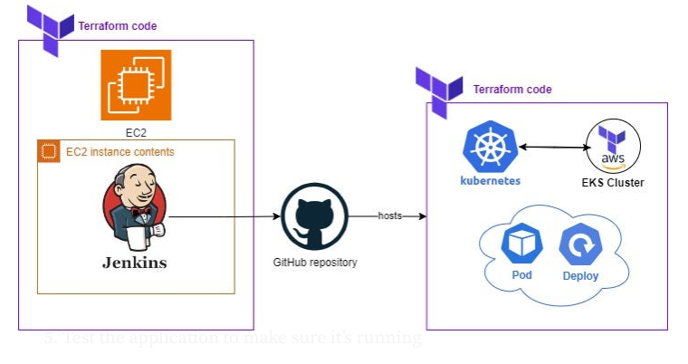

## Technologies Used
- **Jenkins**: For continuous integration and deployment.
- **Kubernetes (EKS)**: For container orchestration.
- **Terraform**: For infrastructure as code.
- **AWS**: For cloud infrastructure.
- **Docker**: For containerizing the Nginx web server.
- **GitHub**: For version control and repository management.

## Project Description
This repository contains the solution to deploy an Nginx web server into an EKS cluster using Jenkins and Terraform.

The project is divided into the following steps:

1. Create a Jenkins server and install all the dependencies.
2. Access and set up the Jenkins server with GitHub and AWS credentials.
3. Create a Jenkins pipeline to deploy the EKS Cluster. 
4. Create another Jenkins pipeline to build and deploy the Nginx web server to the EKS cluster using K8 deployment and service.
5. Test the application to ensure it is running correctly.
6. Clean up and destroy all resources.

This project is designed for a single environment deployment, so we will only have a development environment.

### Project Structure
1. **terraform-jenkins-server**: Terraform code to create the Jenkins server and install all dependencies locally.
2. **terraform-eks-deployment**: Terraform code to create the EKS cluster and ECR using Terraform via Jenkins pipeline.
3. **kubernetes**: Contains the Dockerfile to create the Nginx web server with a custom `index.html` and YAML files to create the deployment and services.
4. **Jenkinsfile**: Groovy script to create the EKS cluster.
5. **Jenkinsfile-build-deploy-nginx**: Groovy script to build and deploy the Nginx web server to the EKS cluster.
6. **Jenkinsfile-destroy**: Groovy script to destroy AWS Terraform resources, specifically the EKS cluster.

## Prerequisites
Before running this project, make sure you have the following prerequisites:

- AWS Account
- Git installed on your local computer.
- Terraform installed on your local computer. 
- Visual Studio Code Installed on your computer. https://www.linkedin.com/pulse/working-terraform-git-visual-studio-code-shubham-kumar-jain
- Create S3 bucket to store the Terraform state file.
- Create IAM user with enough permissions to create resources in AWS.
- Create programmatic access keys for the IAM user so that terraform can create resources in AWS. 
- Set up AWS credentials locally with aws configure. 
- EC2 Key pair for your Jenkins server - use the same name in the key_name section of the Jenkins server.

## Installation
To install and set up the project, follow these steps:
1. Fork the Git repository to your personal account and update the repo name starting with your name.
   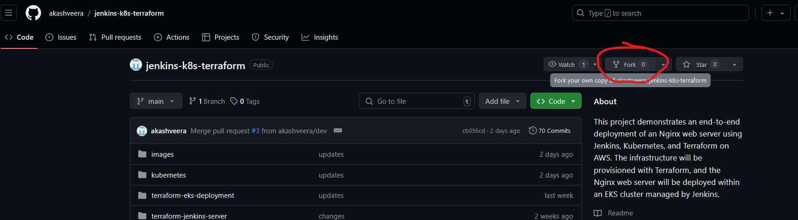
   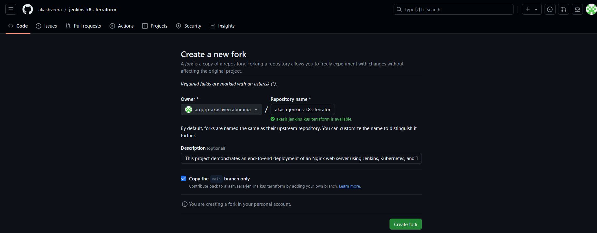

2. Clone your forked repository on your local computer.
    ```sh
    git clone https://github.com/arqgrp-akashveerabomma/akash-jenkins-k8s-terraform.git
    ```

## Running the Project
This project is divided into four major sections:

### Jenkins Server Creation and Setup
To create and set up the Jenkins server, follow these steps:

1. **Prepare Configuration Files**:
   - **Update `terraform.tfvars` in `terraform-jenkins-server` folder**:
     - Set `key_name` to your EC2 key pair name created earlier.
     - Set `ssh_access_cidrs` and `jenkins_ui_access_cidrs` to your laptop's public IP address for SSH and browser access.
     - Save the file.
   - **Update `terraform.tfvars` in `terraform-eks-deployment` folder**:
     - Set `creator_principal_arn` and `console_user_principal_arn` to the IAM user/role ARNs who created the EKS cluster and need console access.
     - Save the file.
   - **Update `backend.tf` in `terraform-eks-deployment` and `terraform-jenkins-server` folder**:
     - Set `bucket` to the name of the S3 bucket you created earlier.
     - Save the file.
   - **Update `Jenkinsfile-build-deploy-nginx`**:
     - Set `AWS_ACCOUNT_ID` to your AWS account ID.
     - Save the file.

2. **Push Changes to Remote Repository**:
   - Commit and push the changes to the main branch of your remote Git repository.

3. **Navigate to the Jenkins Project Directory**:
    ```sh
    cd akash-jenkins-k8s-terraform/terraform-jenkins-server
    ```

4. **Run the Terraform Commands to Deploy the Jenkins Server in AWS**:
    ```sh
    terraform init
    terraform validate
    terraform plan
    terraform apply -auto-approve
    ```

    Make a note of the public IP address of your Jenkins server, which will be printed in the console.

5. **Access and Set Up the Jenkins Server with GitHub and AWS Credentials**:
   1. Paste the IP address into your web browser's address bar, followed by ':8080'. The Jenkins server welcome page should appear.
   

   2. To access the Jenkins server, you need a password. Connect to your EC2 instance through SSH by running the following command in your terminal:
   ```sh
    ssh -i "path_to_your_key.pem" ec2-user@your_ec2_instance_ip_address
   ```

   3. Once connected, run the following command to get the Jenkins password:
   ```sh
   sudo cat /var/lib/jenkins/secrets/initialAdminPassword
   ```
   

   4. Copy the password and paste it into the Jenkins server welcome page to access Jenkins.
   

   5. Install the suggested plugins and create a new user to access Jenkins.
   
   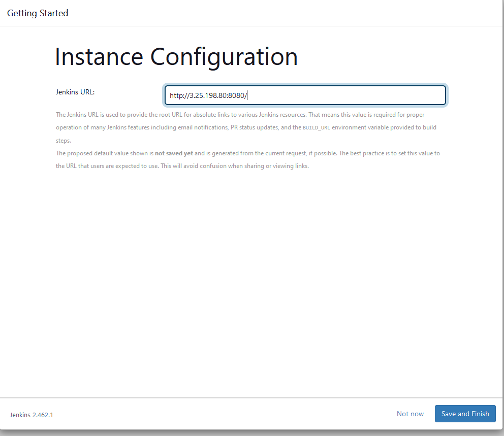

   6. Configure Jenkins to connect to your GitHub repository. Go to Manage Jenkins -> Configure Credentials -> Click on Global -> Add Credentials.

   7. Select "Username with password" in the kind field and insert your GitHub username and password. Give a random ID that can be your username as well.
   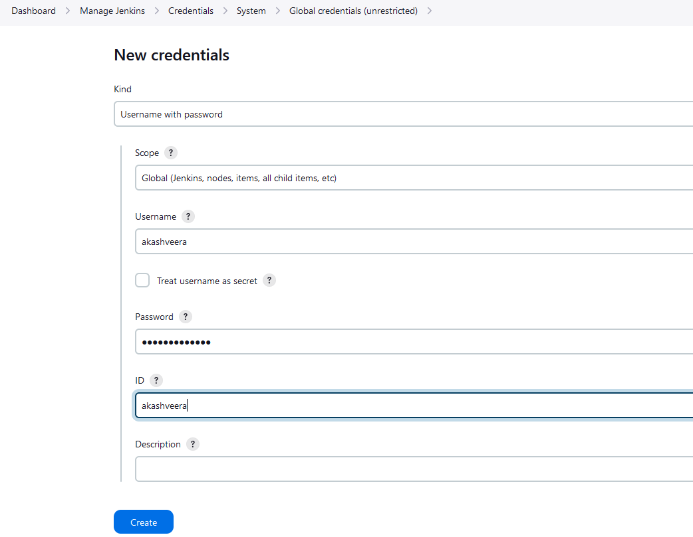

   8. To allow Jenkins to access your AWS environment, add the credentials to your AWS account, specifically the AWS Access Key and AWS Secret Key.

   9. Go to Manage Jenkins -> Manage Credentials -> Click on Global -> Add Credentials -> select "Secret text". Specify "AWS_ACCESS_KEY_ID" in the ID field and paste your AWS Access Key in the Secret field.
   

   10. Repeat the same process for the AWS Secret Key, but specify "AWS_SECRET_ACCESS_KEY" in the ID field.
   

   11. Now you can configure your Jenkins job to connect to your AWS environment and deploy the EKS cluster.

### Deploy EKS Cluster
To deploy the EKS cluster, follow these steps:

1. Navigate to Jenkins -> New Item -> select "Pipeline" -> name it "aws-terraform-jenkins-pipeline".
   

2. Click OK and then scroll to the bottom of the page. Under Pipeline, select "Pipeline script from SCM" and choose "Git". Provide your GitHub Repository URL and select the credentials defined earlier.
   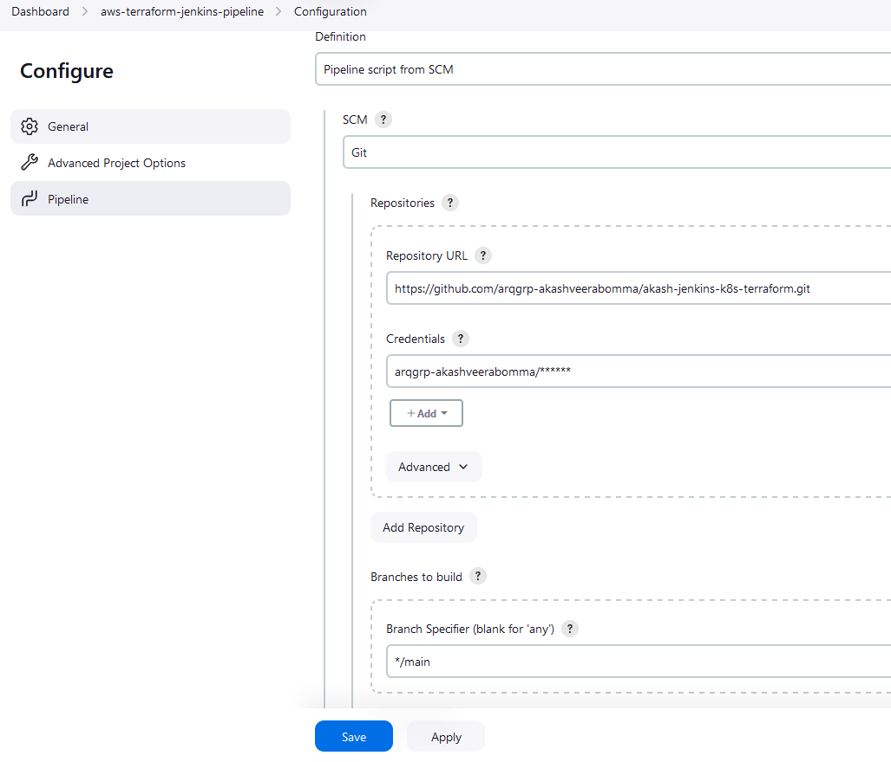

3. Select your branch "main" and write "Jenkinsfile" in the script path field. Click save.
   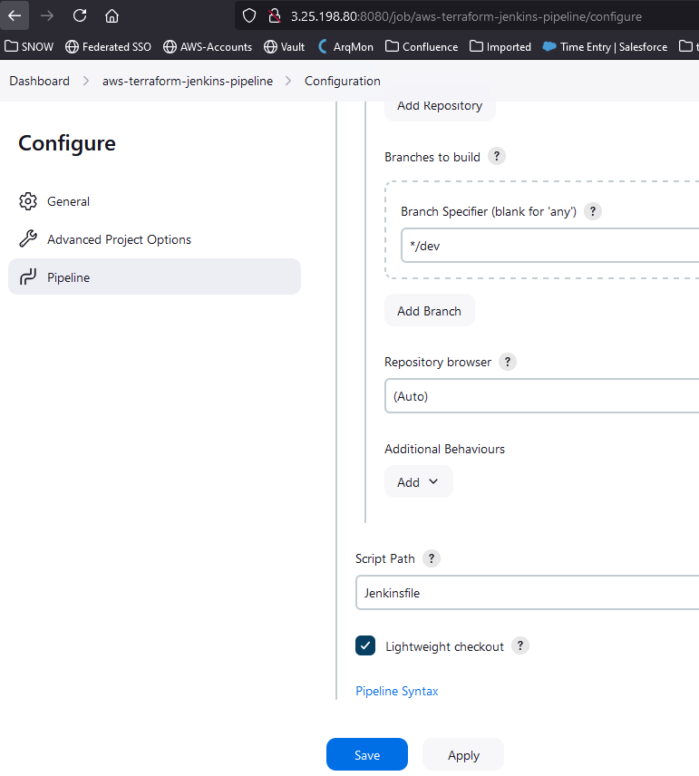

4. Before clicking "Build Now", install the AnsiColor plugin on your Jenkins server. Go to Manage Jenkins -> Plugins -> Available plugins -> Search for AnsiColor and Docker -> select Ansicolor, Docker and Docker Pipeline (Required for the enxt pipeline)-> Click Install.
   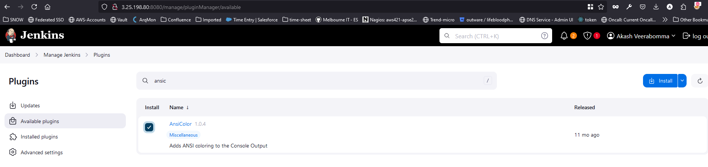

5. Run the Jenkins job to deploy the EKS cluster. Click on "Build Now" on the Jenkins pipeline.
   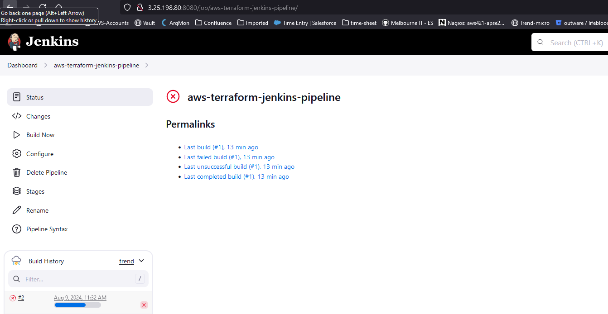

   Jenkins will take about 10-15 minutes to create the EKS cluster.
   

6. Once the job is complete, you can verify that the EKS cluster has been created successfully.
   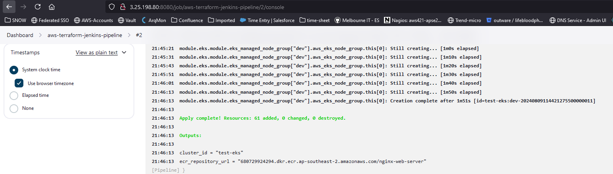
   
   

### Deploy Nginx Web Server
To deploy Nginx web server using Dockerfile and K8 Deployment and Service, follow these steps:

1. Navigate to Jenkins -> New Item -> select "Pipeline" -> name it "build-deploy-nginx-server" -> Click OK.
   

2. Scroll to the bottom of the page and under Pipeline, select "Pipeline script from SCM". Choose "Git" and provide your GitHub Repository URL. Select the credentials defined earlier.
   

3. Select your branch and write "Jenkinsfile-build-deploy-nginx" in the script path field. Click save.
   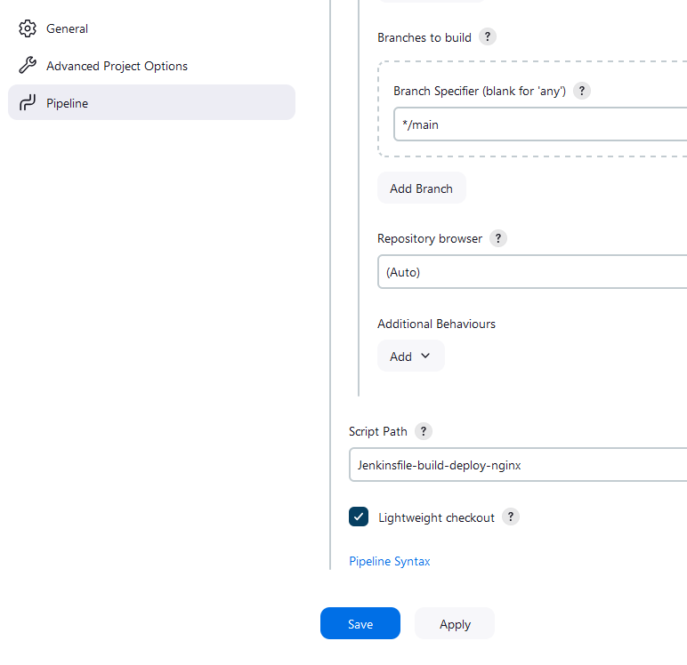

4. Run the Jenkins job to deploy the Nginx web page. Click on "Build Now".

5. The pipeline will output the LoadBalancer IP, which you can access in your web browser to view the updated web page.

### Clean Up and Destroy Resources
To clean up and destroy all resources, follow these steps:

1. Navigate to Jenkins -> New Item -> select "Pipeline" -> name it "destroy-resources" -> Click OK.
   

2. Scroll to the bottom of the page and under Pipeline, select "Pipeline script from SCM". Choose "Git" and provide your GitHub Repository URL. Select the credentials defined earlier.

3. Select your branch and write "Jenkinsfile-destroy" in the script path field. Click save.

4. Click "Build Now" to destroy the Kubernetes deployment and service, as well as the EKS cluster.

5. To delete the Jenkins Server, navigate to the Jenkins project directory:
    ```sh
    cd akash-jenkins-k8s-terraform/terraform-jenkins-server
    ```

6. Run the Terraform commands to destroy the Jenkins server in AWS:
    ```sh
    terraform init
    terraform destroy -auto-approve
    ```

## License
This project is created by Akash Veerabomma.