# superloop-technical-assessment
This project demonstrates an end-to-end deployment of an Nginx web server using Jenkins, Kubernetes, and Terraform on AWS. The infrastructure will be provisioned with Terraform, and the Nginx web server will be deployed within an EKS cluster managed by Jenkins. The project follows a structured approach, with each step building upon the previous one.


## Project Description
This repository contains the solution for the Superloop technical assessment. The project demonstrates the implementation of an Nginx web server through Jenkins and Kubernetes, using Terraform.

The project is divided into the following steps:

1. Create a Jenkins server and install all the dependencies.
2. Access and set up the Jenkins server with GitHub and AWS credentials.
3. Create a Jenkins pipeline to deploy the EKS Cluster and build and deploy the Nginx web server to the EKS cluster using K8 deployment and service.
4. Create another Jenkins pipeline to update the index.html with the EKS cluster name and load balancer IP.
5. Test the application to ensure it is running correctly.
6. Clean up and destroy all resources.

This project is designed for a single environment deployment, so we will only have a development environment.

### Project Structure
1. terraform-jenkins-server: Terraform code to create the Jenkins server and install all dependencies locally.
2. terraform-eks-deployment: Terraform code to create the EKS cluster and ECR using Terraform via Jenkins pipeline.
3. kubernetes: Contains the Dockerfile to create the Nginx web server with a custom index.html and YAML files to create the deployment and services.
4. Jenkinsfile: Groovy script to create the EKS cluster.
5. Jenkinsfile-build-deploy-nginx: Groovy script to build and deploy the Nginx web server to the EKS cluster.
6. Jenkinsfile-destroy: Groovy script to destroy AWS Terraform resources, specifically the EKS cluster.

## Prerequisites
Before running this project, make sure you have the following prerequisites:

- AWS Account
- Git installed on your local computer.
- EC2 Key pair for your Jenkins server - use the same name in the key_name section of the Jenkins server.
- Terraform installed on your local computer.
- IAM credentials with enough permissions to create resources in AWS and programmatic access keys.
- AWS credentials set up locally with aws configure.

## Installation
To install and set up the project, follow these steps:

1. Clone the repository:
    ```sh
    git clone https://github.com/yourusername/superloop-technical-assessment.git
    ```

2. Navigate to the project directory:
    ```sh
    cd superloop-technical-assessment
    ```

3. Install the dependencies:
    ```sh
    [Terraform and AWS CLI]
    ```

## Running the Project
This project is divided into four major sections:

### Jenkins Server Creation and Setup
To create and set up the Jenkins server, follow these steps:

1. Navigate to the Jenkins project directory:
    ```sh
    cd superloop-technical-assessment/terraform-jenkins-server
    ```

2. Make the following changes before running the Terraform commands:
   - Update the key_name in the server.tf file to your EC2 key pair name.
   - Update the region in the server.tf file to your preferred region.
   - Update the IP address in the security.tf file to access the Jenkins server via SSH and browser.
   - Update the instance_type in the server.tf file to your preferred instance type.

3. Run the Terraform commands to deploy the Jenkins server in AWS:
    ```sh
    terraform init
    terraform validate
    terraform plan
    terraform apply -auto-approve
    ```

    Make a note of the public IP address of your Jenkins server, which will be printed in the console.

4. Access and set up the Jenkins server with GitHub and AWS credentials:
   1. Paste the IP address into your web browser's address bar, followed by ':8080'. The Jenkins server welcome page should appear.
   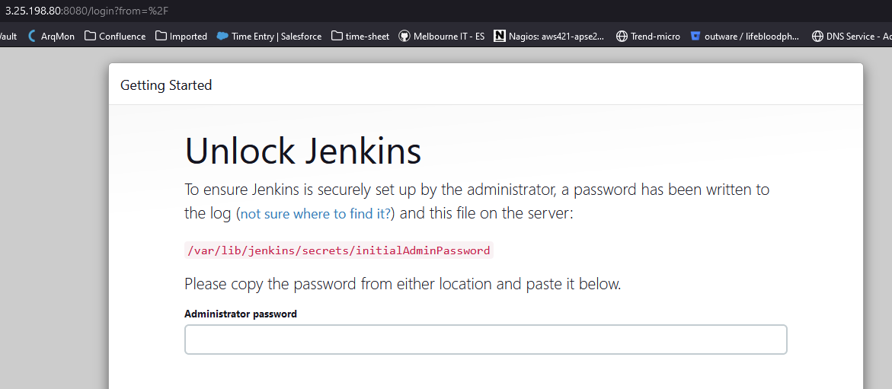

   2. To access the Jenkins server, you need a password. Connect to your EC2 instance through SSH by running the following command in your terminal:
   ```sh
    ssh -i "path_to_your_key.pem" ec2-user@your_ec2_instance_ip_address
   ```

   3. Once connected, run the following command to get the Jenkins password:
   ```sh
   sudo cat /var/lib/jenkins/secrets/initialAdminPassword
   ```
   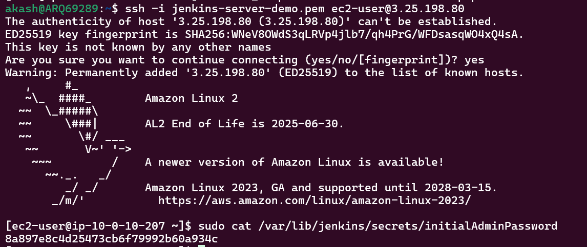

   4. Copy the password and paste it into the Jenkins server welcome page to access Jenkins.
   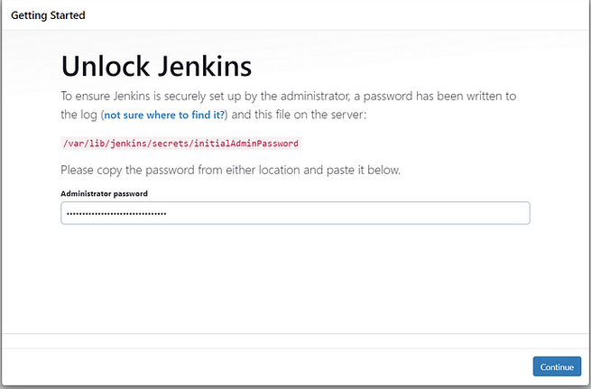

   5. Install the suggested plugins and create a new user to access Jenkins.
   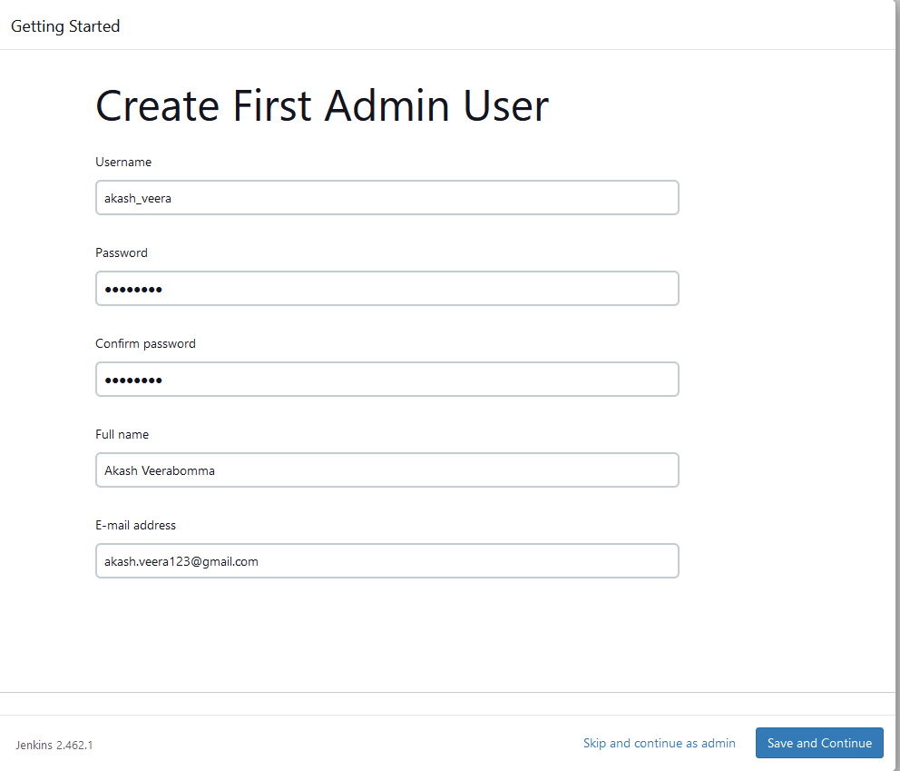
   

   6. Configure Jenkins to connect to your GitHub repository. Go to Manage Jenkins -> Manage Credentials -> Click on Global -> Add Credentials.

   7. Select "Username with password" in the kind field and insert your GitHub username and password. Give a random ID that can be your username as well.
   

   8. To allow Jenkins to access your AWS environment, add the credentials to your AWS account, specifically the AWS Access Key and AWS Secret Key.

   9. Go to Manage Jenkins -> Manage Credentials -> Click on Global -> Add Credentials -> select "Secret text". Specify "AWS_ACCESS_KEY_ID" in the ID field and paste your AWS Access Key in the Secret field.
   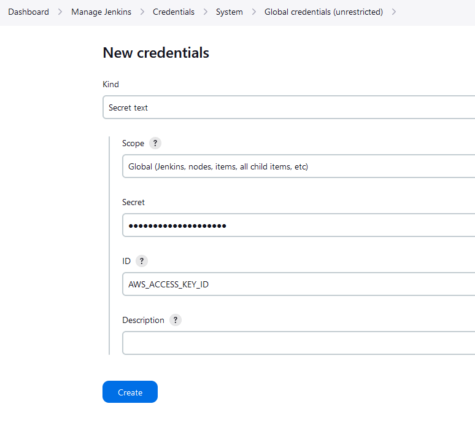

   10. Repeat the same process for the AWS Secret Key, but specify "AWS_SECRET_ACCESS_KEY" in the ID field.
   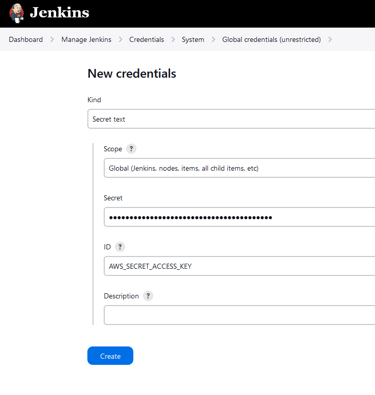
   
   11. Now you can configure your Jenkins job to connect to your AWS environment and deploy the EKS cluster.

### Deploy EKS Cluster and Nginx Web Server
To deploy the EKS cluster and Nginx web server using the Jenkins pipeline, follow these steps:

1. Navigate to Jenkins -> New Item -> select "Pipeline" -> name it "aws-terraform-jenkins-pipeline".
   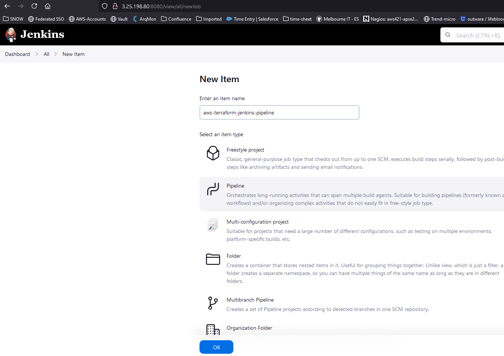

2. Click OK and then scroll to the bottom of the page. Under Pipeline, select "Pipeline script from SCM" and choose "Git". Provide your GitHub Repository URL and select the credentials defined earlier.
   

3. Select your branch and write "Jenkinsfile" in the script path field. Click save.
   

4. Before clicking "Build Now", install the AnsiColor plugin on your Jenkins server. Go to Manage Jenkins -> Plugins -> Available plugins -> Search for AnsiColor -> select -> install.
   

5. Run the Jenkins job to deploy the EKS cluster. Click on "Build Now" on the Jenkins pipeline.
   

   Jenkins will take about 10-15 minutes to create the EKS cluster.
   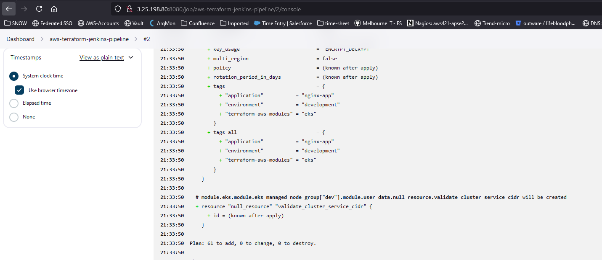

6. Once the job is complete, you can verify that the EKS cluster has been created successfully and the Nginx web server has been created with the LoadBalancer IP outputted in the pipeline.
   
   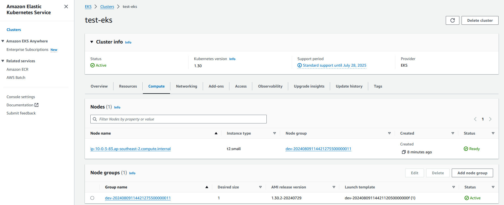
   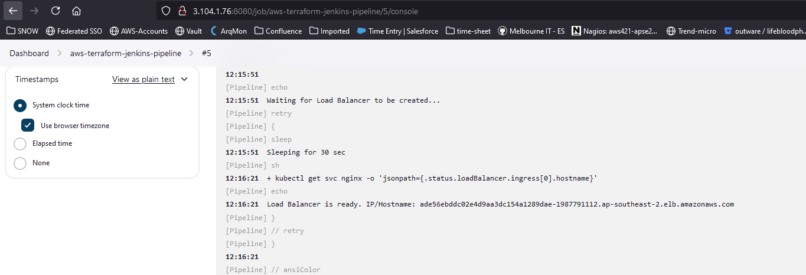

### Update Nginx Web Page
To update the Nginx web page to output the EKS cluster name and LoadBalancer IP, follow these steps:

1. Navigate to Jenkins -> New Item -> select "Pipeline" -> name it "build-deploy-nginx-server" -> Click OK.
   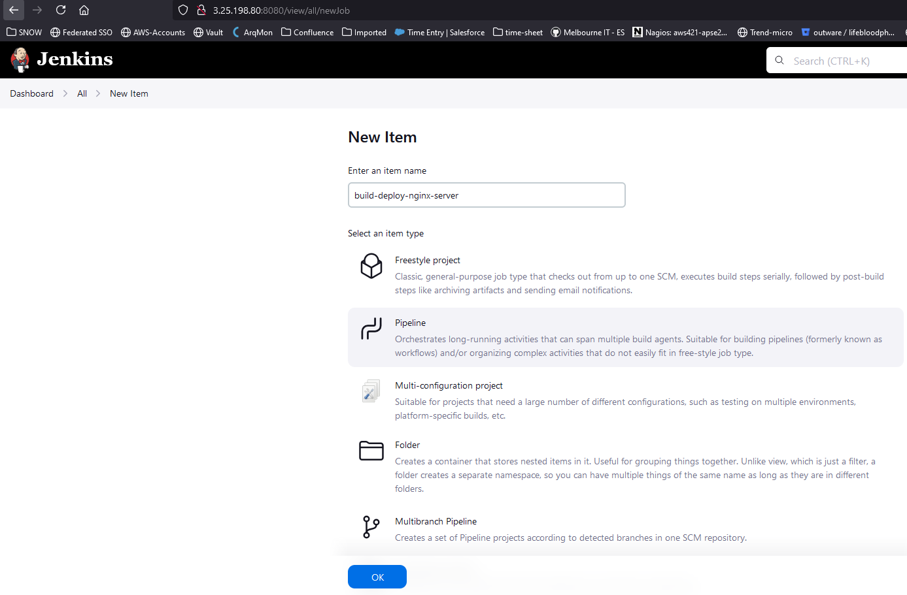

2. Scroll to the bottom of the page and under Pipeline, select "Pipeline script from SCM". Choose "Git" and provide your GitHub Repository URL. Select the credentials defined earlier.
   

3. Select your branch and write "Jenkinsfile-build-deploy-nginx" in the script path field. Click save.
   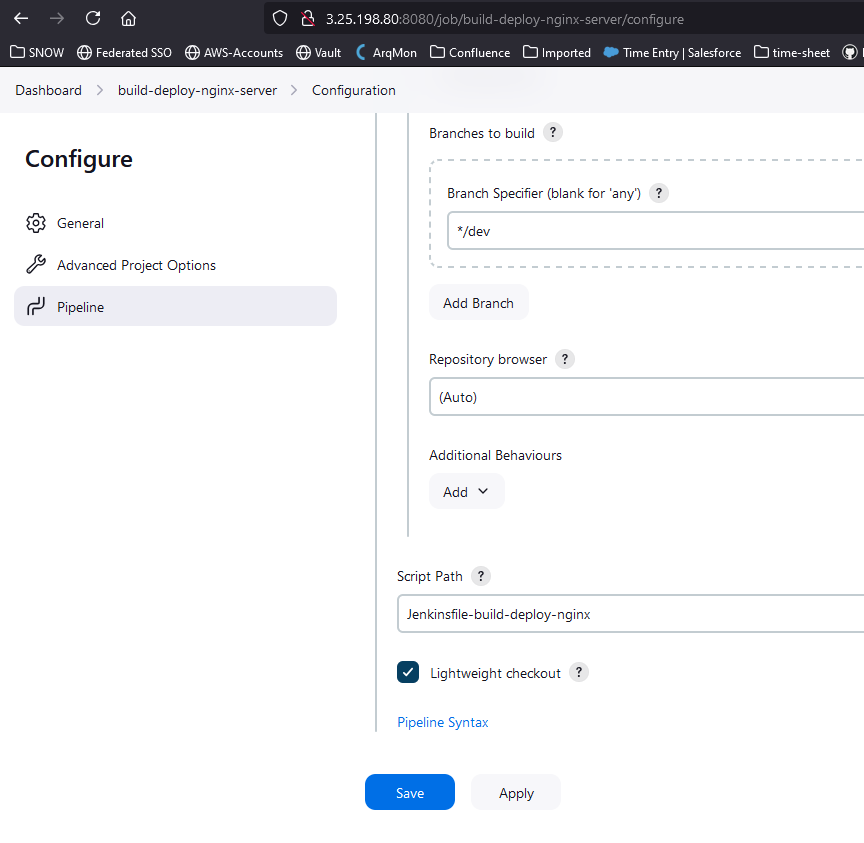

4. Before clicking "Build Now", install the Docker plugin on your Jenkins server. Go to Manage Jenkins -> Plugins -> Available plugins -> Search for Docker -> select Docker and Docker Pipeline -> Click Install.
   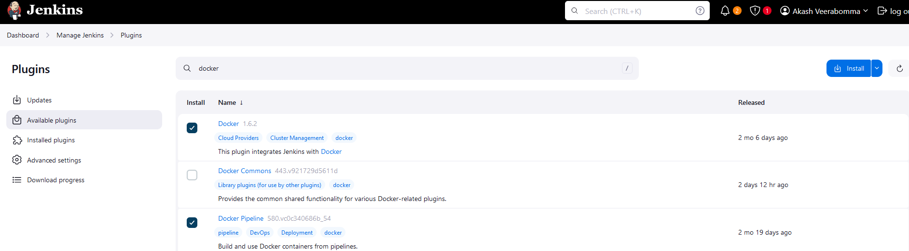

5. Run the Jenkins job to deploy the updated Nginx web page. Click on "Build Now".

6. The pipeline will output the LoadBalancer IP, which you can access in your web browser to view the updated web page.

### Clean Up and Destroy Resources
To clean up and destroy all resources, follow these steps:

1. Navigate to Jenkins -> New Item -> select "Pipeline" -> name it "destroy-resources" -> Click OK.
   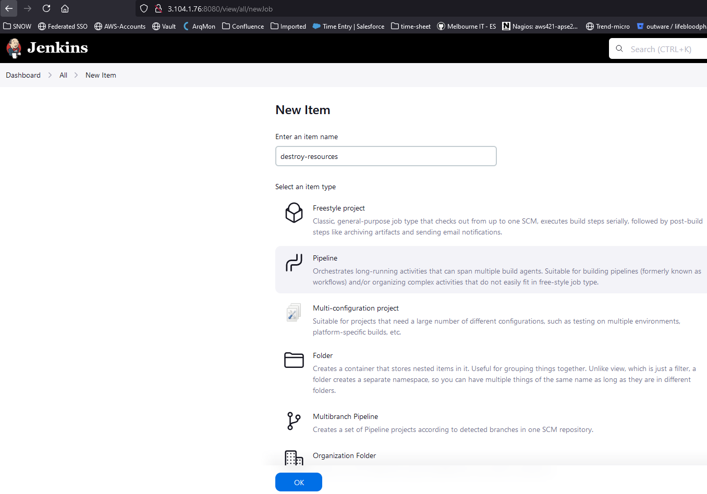

2. Scroll to the bottom of the page and under Pipeline, select "Pipeline script from SCM". Choose "Git" and provide your GitHub Repository URL. Select the credentials defined earlier.

3. Select your branch and write "Jenkinsfile-destroy" in the script path field. Click save.

4. Click "Build Now" to destroy the Kubernetes deployment and service, as well as the EKS cluster.

5. To delete the Jenkins Server, navigate to the Jenkins project directory:
    ```sh
    cd superloop-technical-assessment/terraform-jenkins-server
    ```

6. Run the Terraform commands to destroy the Jenkins server in AWS:
    ```sh
    terraform init
    terraform destroy -auto-approve
    ```

## License
This project is created by Akash Veerabomma.